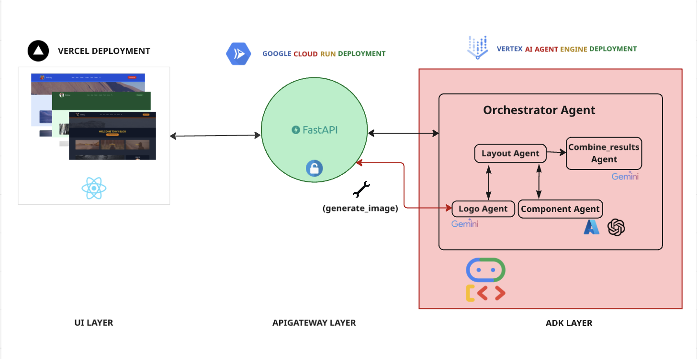

# GENUI-ADK – Generative UI POC

**GENUI-ADK** is a proof-of-concept project that delivers **rapid UI personalization** for users visiting any website. It leverages a generative approach to dynamically tailor experiences in real-time.

- **Frontend**: Built with [React](https://reactjs.org/)
- **Backend**: Powered by [Google's Agent Development Kit (ADK)](https://developers.google.com/agent-development-kit)

---

## 🚀 Features

- Personalized UI generation at runtime
- Modular and extensible architecture
- Seamless integration of React UI with ADK agents

---

## Architecture

Below is the architecture diagram for the GENUI-ADK

<p align="center">
  
</p>


## 🛠️ Installation

### 1. Prerequisites

- Python ≥ 3.9
- Node.js & npm

### 2. Set up Python Virtual Environment

```bash
python3 -m venv .venv
source .venv/bin/activate
```
--- 

## ⚙️ Backend Setup

### Install and Run Backend
```bash
cd server
pip install -r requirements.txt
cp .env.example .env
# Edit the .env file and add necessary credentials
adk run <folder_name>
```

### Run API Server Only
```bash
cd server
adk api_server
adk api_server --allow_origins http://localhost:3000
```

### Run Dev UI (ADK web)
```bash
cd server
adk web
```

### Testing Reference
Use the resource - [ADK Testing](https://google.github.io/adk-docs/get-started/testing/#local-testing)

---

## 🎨 Frontend Setup

### Install and Run Frontend
```bash
cd client
npm install
npm run start
```
Visit the application at: http://localhost:3000

---

## 📁 Project Structure
```bash
GENUI/
├── client/       # React frontend
├── server/       # ADK backend
├── .env.example  # Environment variables template
└── README.md     # Project overview and setup
```

## Api Gateway

The `ApiGateway` acts as a gateway server for token access, for accessing agent layer endpoints and image generation tool

```bash
Create and Activate the Python Environment

python3 -m venv .venv
source .venv/bin/activate
```

```
Create .env and Set the Required Environment Variables

GOOGLE_API_KEY=" "
CLOUDINARY_CLOUD_NAME=' '
CLOUDINARY_API_KEY=' '
CLOUDINARY_API_SECRET=' '
IMG_MODEL = " "

```

## Deploy ApiGateway to Cloud Run Follow this steps

### STEP 1 : Containerize the Application and push to Gcloud Artifact Registry
```
docker buildx build -t apigatewaygenui --platform linux/amd64 .
```
```
docker tag apigatewaygenui:latest  us-central1-docker.pkg.dev/genuiagent/apigatewaygenui/apigatewaygenui:latest
```
```
docker push us-central1-docker.pkg.dev/genuiagent/apigatewaygenui/apigatewaygenui:latest
```
### STEP 2 :

#### Create a Cloud Run from gcloud console using artifact registry 

Manually create a cloud run deployment using the above image in GCP portal and deploy it

## Deploy Vertex AI Agent Engine

Create .env and Set the Required Environment Variables

```
GOOGLE_CLOUD_PROJECT=""
GOOGLE_CLOUD_LOCATION=""
GOOGLE_CLOUD_STAGING_BUCKET=""
GOOGLE_API_KEY=''
GOOGLE_GENAI_USE_VERTEXAI=FALSE
AZURE_API_KEY=""
AZURE_API_BASE=""
AZURE_API_VERSION=""
CLOUDINARY_CLOUD_NAME=''
CLOUDINARY_API_KEY=''
CLOUDINARY_API_SECRET=''
FASTAPI_URL = ""
GEMINI_MODEL = ""
MODEL_GPT_41 = ""
```

Run the below command to deploy the `Agent Layer` in the server to `Vertex AI Agent Engine`

```
cd server/deployment
python deploy.py
```